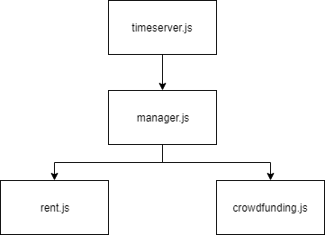

# 時間伺服器

## 啟動步驟
### 1. npm install
### 2. npm run time
---
## 架構圖

### timeserver: timeserver/timeserver.js
### manager: manager/manager.js
### crowdfunding: manager/crowdfunding.js
### rent: manager/rent.js
---
## TODO:
### 1. crowdfunding/rent 收到時間後要做什麼？
### 2. 註冊發送時間(目前每20秒發送一次時間)